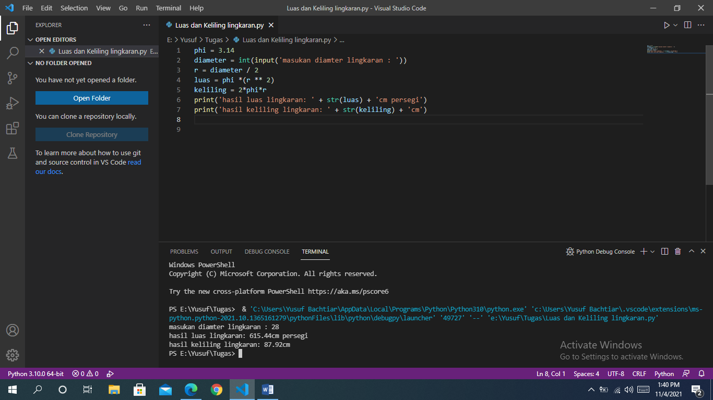

<p align="center"> TUGAS PEMROGRAMAN - KELILING & LUAS LINGKARAN

<p align="justify">Tugas Pemgrogaman membuat program menghitung Luas & Keliling Lingkaran menggunakan bahasa pemrograman python.

---
<br>


# [Tugas 4.py](https://github.com/YusufBachtiar123/Tugas_4_Luas_dan_Keliling)

<p align="justify">Berisi syntax menghitung Luas & Keliling dalam bahasa pemrograman python.

- Variabel phi, berfungsi untuk mendeklarasikan (3.14).
```sh
phi = 3.14
```
- Input diameter, menggunakan variabel integer.
```sh
diameter = int(input('Masukan diameter lingkaran: '))
```
- Menghitung proses keliling lingkaran.
```sh
keliling = 2 * phi * r
```
- Menghitung proses luas lingkaran.
```sh
luas = phi * (r  ** 2)
```
- Print luas & keliling lingkaran.
```sh
print('hasil luas lingkaran : ' + str(luas) + 'cm persegi' )
Diatas akan menampil kan variabel luas

print('hasil keliling lingkaran : '+ str(keliling) + 'cm')
Diatas akan menampil variabel Keliling
```
----
# Hasil Output Program Luas & Keliling Lingkaran

